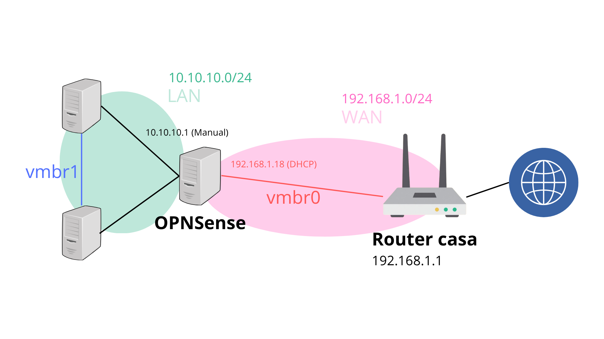

# Projecte: Sistema complet de Proxmox

## Pasos previs a la instal·lació
- Per començar, utilitzarem Rufus per fer que l'USB amb l'imatge de Proxmox dins sigui Bootable.

### Hardware utilitzat:

Crucial BX500 240 Gb - Un disc SSD SATA3, amb velocitat de lectura de 540 MB/s. Suficient per al context: laboratori lleuger

Veure: !(Errors)

## Instal·lació

- Proxmox en mode Terminal UI amb el paràmetre "nomodeset" activat (per evitar un error de freeze per la GPU NVIDIA=
- En Target Harddisk Crucial BX500, amb el sistema de fitxers ext4
- IP del servidor: `192.168.1.50/24`

## Primera màquina del sistema

Abans de crear la màquina, haviem de deshabilitar el repositori enterprise, que requereix una suscripció pagada, i afegir el repositori no-subscription, el repo gratuit de Proxmox, vàlid pel que voldrem fer.

### OPNSense

La màquina que farà de router/firewall.
Per a la ISO, seleccionem la arquitectura amd64 tipus dvd i fem la descàrrega directa a Proxmox (Opció `Download from URL`)

#### Disseny de la xarxa

Com OPNSense necessita dos "cares" de la xarxa (WAN, la que apunta a internet, i LAN, la que mira a la xarxa interna), hem de crear una xarxa virtual més. 
- `vmbr0`: la que ja tenim que farà de WAN i per on OPNSense sortirà a internet.
- `vmbr1`: nova, sense tarjeta física, intern, que farà de LAN.

### Diagrama de xarxa

El `vtnet0` (WAN) té la ip `192.168.1.18`, assignada pel router mitjançant DHCP. Mentre que el `vtnet1` (LAN) té la ip que hem escrit manualment, `10.10.10.1`

#### Paràmetres

|  | Paràmetres |
|-----------|-----------|
| ID | 100  | 
| Nom | opnsense | 
| Machine | Default (1440fx) | 
| BIOS | Default (SeaBIOS) | 
| Bus/Device | SCSI | 
| SCSI Controller | VirtIO SCSI single |
| Storage | local-lvm | 
| Disk size | 20 GiB | 
| Sockets | 1 | 
| Cores | 1 | 
| Type | host | 
| Memory | 2048 MiB | 
| Balloning Device | No | 
| Bridge | vmbr0 | 
| Network Model | VirtIO | 

